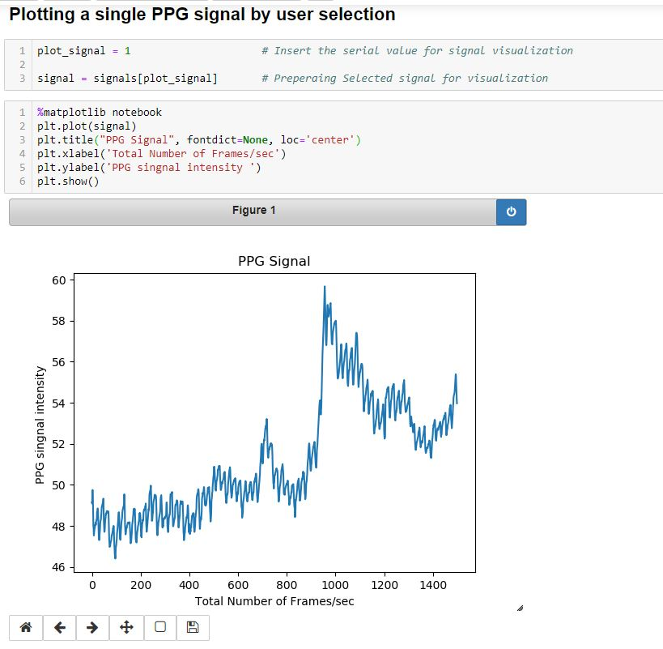

Your README.md file is already well-structured and informative. However, I can suggest some improvements to enhance clarity and readability:

---

# PPG_Python_Research

This repository contains codes for PPG Signal Processing Research.

## Installation
To get started, clone this repository and navigate to its directory:

```Shell
git clone https://github.com/sajidahmed12/PPG_Python_Research
cd PPG_Python_Research
```

## Video to PPG Conversion
To convert video data into PPG signals:
1. Place all video data into the `data` folder.
2. Open a terminal in the repository's directory and activate your virtual environment.
3. Run the following command:

```Shell
python3 Video_to_ppg.py
```

## Visualization
Example of visualizing raw PPG signals using Matplotlib:



## Requirements
Ensure you have the following dependencies installed:
- OpenCV Version 3.4++
- NumPy
- Pandas
- Glob
- Tqdm
- Matplotlib

## Authors
- [Md Sajid Ahmed](https://www.linkedin.com/in/sajid-ahmed-rafi/)

## Supervisors
- [Dr. Tanzilur Rahman](http://ece.northsouth.edu/people/dr-tanzilur-rahman-2/)
- [Syed Atahar Bin Amir](http://ece.northsouth.edu/people/mr-syedathar-binamir/)

## Contact
For any questions about our paper or code, please contact [Md Sajid Ahmed](mailto:sajid.ahmed1@northsouth.edu).

---

These adjustments aim to improve clarity, provide clear instructions, and maintain consistency throughout the README file.
